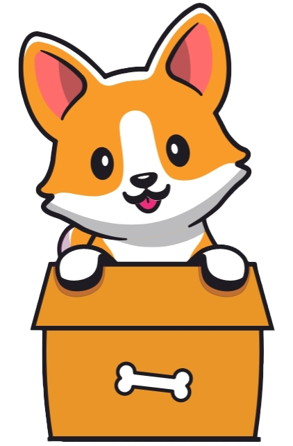

# MyPet

 An app tailor-made for your pet.

## About MyPet

MyPet is a project developed by 2 students from the University of Insubria in Varese. 
 
This app aims to store all the information inside the health booklet of your pet, so you always have them with you and make everything more comfortable, here there are some features:
- Mark your vet appointments.
- A pedometer for your pet's walks.
- Collection of emergency numbers.
- Mark all vaccines made to the pet.

## Built with
MyPet is an Android application developed in Kotlin, with the help of other programs and libraries:
- Android Studio
- Kotlin
- Google API
- Firebase
- Lottie
- Material Design
